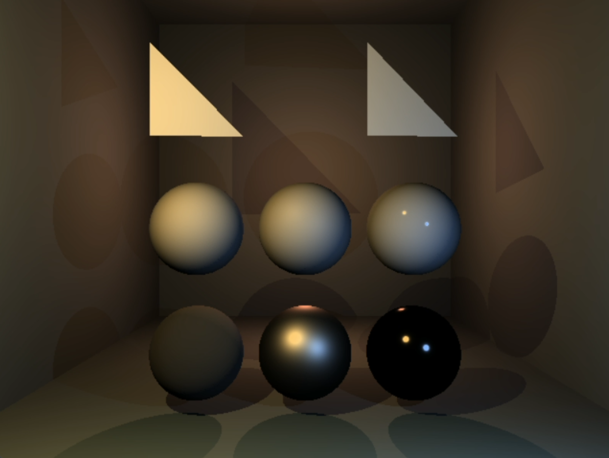
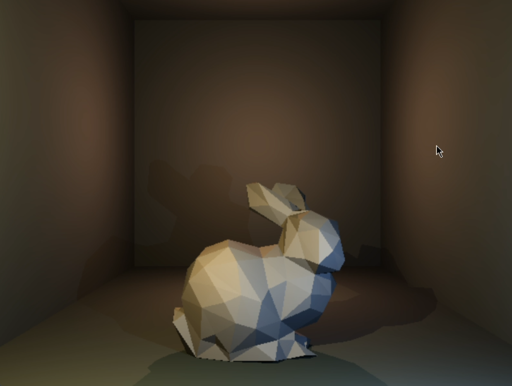

# CPU Raytracer

## Overview

This is a C++ implementation of a basic raytracer, a type of global illumination rendering algorithm. The code is designed to simulate the physical properties of light and its interaction with 3D objects in a scene.

## Features

*   **Raytracing Algorithm**: The code implements a simple ray tracing algorithm that simulates the bouncing of light rays off objects in a scene.
*   **Geometric Primitives**: The code supports basic geometric primitives such as spheres, planes, and cylinders.
*   **Lighting**: The code supports two types of lighting: ambient lighting and diffuse lighting.
*   **Material**: The code supports simple material properties such as color, reflection, and refraction.

## Example Scenes
  
*Reference scene with basic primitives*

  
*Stanford Bunny scene*
